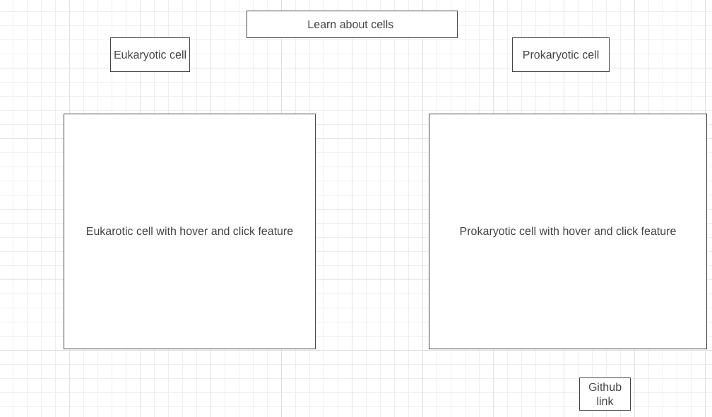

# Cell Explorer Demo

## BackGround
In this demo users will be able to have a fun learning experience. The user will be able to hover and click on organelles of both prokaryotic cell and eukaryotic cell. Upon hover user will see the name of each organelle. Upon click user will be able to see a description of each organelle 

## Project Overview

### Functionality

In this demo, users can:

- When hovering over the organelle the name will show
- Click on organelles to display detailed descriptions of the organelles function
- Explore eukaryotic cells with a visual representation that the user can dynamically interact with
- Explore prokaryotic cells with a visual representation that the user can dynamically interact with
- Side by side visual comparsion of prokaryotic and eukaryotic cells
- There is a nav link that user can click and go to my github

### Technologies, libaries, APIs 
- Javascript
- Canvas 
- HTML
- CSS

### Wireframe 

### Getting Started

To run the Cell Explorer demo:

1. Clone or download the repository.
2. Open the `index.html` file in a web browser.

### Implementation Timeline 
**Wednesday and Thurseday** 
- Finish prokaryotic cell and eukaryotic cell with organelles 

**Weekend** 
- Make the hover feature work for all organelles
- Make the click feature work 

**Monday** 
- Make the description of each organelle to pop up 

**Tuesday** 
- Add to description and make sure functionality is working 

**Wednesday**
- Make sure all functionality is working correctly