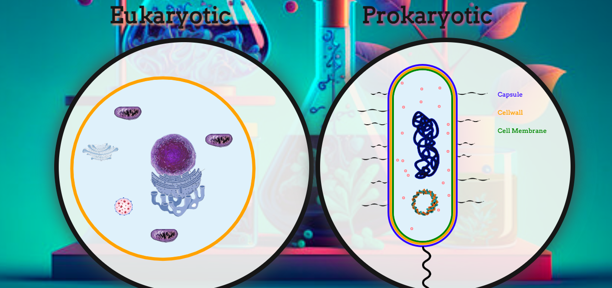
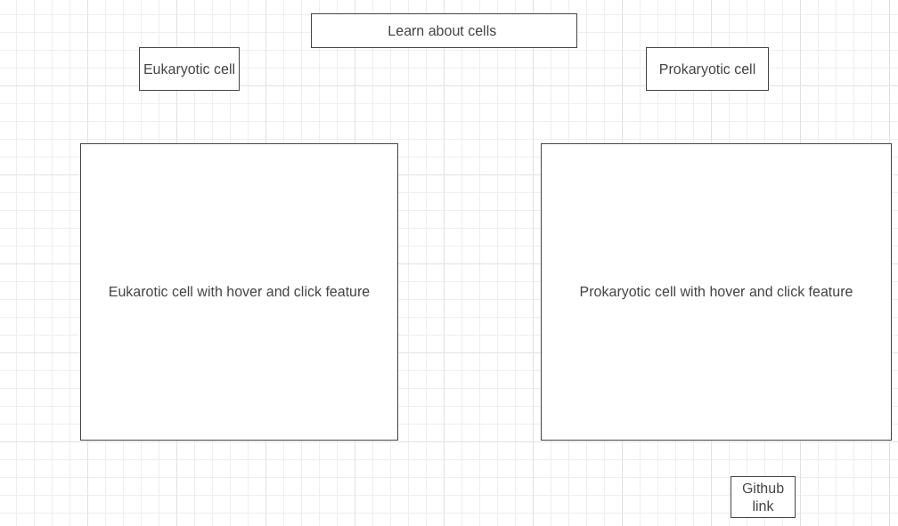

# Cell Explorer 
<a href="https://shaunjhingoor.github.io/JSproject/">Cell Explorer</a> is a 2d interactive demo of a prokaryotic cell and eukaryotic. This demo allows users to look at two different cells side by side and compare them. Also, always users to interact with the demo and gain knowledge of what each organelle does within the cell contained in our body, and the cell trying to invade our body.


<!-- ### Wireframe 

 -->
# Functionality
### In Cell Explorer, users are able to 
    
   
  <video width="600" height="600" autoplay loop>
  <source src="cellanimation.mp4" type="video/mp4">
</video>


 * Compare dynamically [moving](cellanimation.mp4) eukaryotic and prokaryotic cell via 
    - In order to get these animations to make the cell look like it is dynamically moving 
    1. Had to make a canvas drawing which is show in the picture and video as a white somewhat translucent circle. This was done using scss and HTML canvas
    2. In order to add animation and put the picture or drawing onto the canvas I had to have a central class that gave each instance of classes (which would be the elements I wanted to place on my canvas) the context of the canvas.
    3. After giving each class the context of the canvas via my centralized class. I had to include in each class a draw method, update, animate
        - Draw method - drew or sourced the image that I wanted to portray on my canvas 
        - Update method - defined how much I wanted my element to move (aka how much animation I wanted to give my element)
        - Animate method - called both the draw and update method 
            * In my centralized class I also had a animate method that requestAnimationFrame for each instance of a class I gave to my centralized class. This allowed for elements to move on the canvas 
    ```javascript central class
    class Human{
        constructor(ctx){
            this.ctx = ctx 
            this.canvas = this.ctx.canvas
            this.width = this.canvas.width;
            this.height = this.canvas.height;
            this.membrane = new Membrane(this.ctx)
            this.organelles = [this.membrane]
        }
        animate(){
            this.ctx.clearRect(0, 0, this.canvas.width, this.canvas.height);
            this.organelles.forEach(org => org.animate(this.ctx))
            requestAnimationFrame((() => this.animate()))
        }
    }

    class Membrane {
        constructor(ctx) {
            this.ctx = ctx;
            this.x = 225;
            this.y = 275;
            this.radius = 200;
            this.speed = 0.05;
            this.direction = 1;
        }
         draw() {
            this.ctx.beginPath();
            this.ctx.arc(this.x, this.y, this.radius, 0, 2 * Math.PI);
            this.ctx.lineWidth = 7;
            this.ctx.strokeStyle = "orange";
            this.ctx.stroke();
        }

        update(){
            this.x = this.x + this.speed * this.direction;
            this.y = this.y + this.speed * this.direction;
            if (this.x + 1 >= 280 || this.x <= 275 && this.y + 1 >= 280 || this.y <= 275) {
                this.direction *= -1; 
            }
        }

        animate() {
            this.update();
            this.draw();
        }
    }
    ```
* Click on each organelle of a cell and see the name and description of that organelle

    
        
    
  


<!-- ### Getting Started

To run the Cell Explorer demo:

1. Clone or download the repository.
2. Open the `index.html` file in a web browser. -->

<!-- ### Implementation Timeline 
**Wednesday and Thurseday** 
- Finish prokaryotic cell and eukaryotic cell with organelles 

**Weekend** 
- Make the hover feature work for all organelles
- Make the click feature work 

**Monday** 
- Make the description of each organelle to pop up 

**Tuesday** 
- Add to description and make sure functionality is working 

**Wednesday**
- Make sure all functionality is working correctly -->