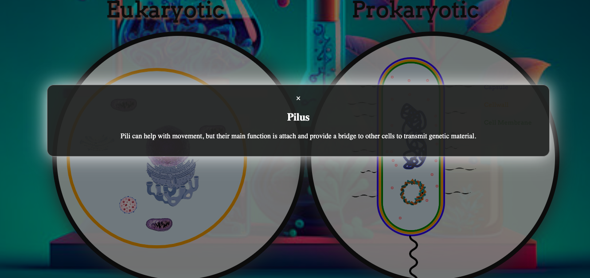

# Cell Explorer 
<a href="https://shaunjhingoor.github.io/JSproject/">Cell Explorer</a> is a 2d interactive demo of a prokaryotic cell and eukaryotic. This demo allows users to look at two different cells side by side and compare them. Also, allows users to interact with the demo and gain knowledge of what each organelle does within the cell contained in our body, and the cell trying to invade our body.


<!-- ### Wireframe 
 <!-- [moving](cellanimation.mp4) -->
<!--  --> 
# Functionality
### In Cell Explorer, users are able to 
   
 * Compare dynamically moving eukaryotic and prokaryotic cell 
    - In order to get these animations to make the cell look like it is dynamically moving 
    1. Had to make a canvas drawing which is show in the picture and video as a white somewhat translucent circle. This was done using scss and HTML canvas
    2. In order to add animation and put the picture or drawing onto the canvas I had to have a central class that gave each instance of classes (which would be the elements I wanted to place on my canvas) the context of the canvas.
    3. After giving each class the context of the canvas via my centralized class. I had to include in each class a draw method, update, animate
        - Draw method - drew or sourced the image that I wanted to portray on my canvas 
        - Update method - defined how much I wanted my element to move (aka how much animation I wanted to give my element)
        - Animate method - called both the draw and update method 
            * In my centralized class I also had a animate method that requestAnimationFrame for each instance of a class I gave to my centralized class. This allowed for elements to move on the canvas 
    ```javascript central class
    class Human{
        constructor(ctx){
            this.ctx = ctx 
            this.canvas = this.ctx.canvas
            this.width = this.canvas.width;
            this.height = this.canvas.height;
            this.membrane = new Membrane(this.ctx)
            this.organelles = [this.membrane]
        }
        animate(){
            this.ctx.clearRect(0, 0, this.canvas.width, this.canvas.height);
            this.organelles.forEach(org => org.animate(this.ctx))
            requestAnimationFrame((() => this.animate()))
        }
    }

    class Membrane {
        constructor(ctx) {
            this.ctx = ctx;
            this.x = 225;
            this.y = 275;
            this.radius = 200;
            this.speed = 0.05;
            this.direction = 1;
        }
         draw() {
            this.ctx.beginPath();
            this.ctx.arc(this.x, this.y, this.radius, 0, 2 * Math.PI);
            this.ctx.lineWidth = 7;
            this.ctx.strokeStyle = "orange";
            this.ctx.stroke();
        }

        update(){
            this.x = this.x + this.speed * this.direction;
            this.y = this.y + this.speed * this.direction;
            if (this.x + 1 >= 280 || this.x <= 275 && this.y + 1 >= 280 || this.y <= 275) {
                this.direction *= -1; 
            }
        }

        animate() {
            this.update();
            this.draw();
        }
    }
    ```
* Click on each organelle of a cell and see the name and description of that organelle
    
    1. In order to get the click to pop up a modal to show the description I need to define a modal.
    2. In each class I need to add in the constructor a instance variable for the name and content 
    3. In a function called create modal I assigned the instance variable to the corresponding section in the modal 
    4. Added a function in each class called handle click which defines where the actual click was (mouseX and mouseY) and compared the actual click to where my x and y where at the time of the click    
        - If my mouseX and mouseY where within and acceptable range from my x and y the showModal method would be called 
    5. The show modal method changes the modal display from none to block allowing it to pop up on the screen 
    ```HTML
        <div id="organelleModal" class="modal">

      <div class="modal-content">
          <span class="close" onclick="closeModal()">&times;</span>
          <h2 id="organelleName"></h2>
          <p id="organelleDescription"></p>
      </div>
  </div>

    <script>
        function closeModal() {
            document.getElementById("organelleModal").style.display = "none";
        }
    </script>
    ```
    

    ```javascript
    class Pilli{
    constructor(ctx,x,y,speed,width) {
        this.ctx = ctx 
        this.x = x
        this.y = y
        this.consty = this.y
        this.changey = this.consty + 5
        this.speed = speed
        this.direction = 1
        this.time = 0
        this.width = width 
        this.modalContent = {
            name: "Pilus",
            description: "Pili can help with movement, but their main function is attach and provide a bridge to other cells to transmit genetic material."
        };
        this.handleModalClick = this.handleModalClick.bind(this)
        this.createModal();
    
    }

        createModal() {
            this.modal = document.getElementById("organelleModal10");
            this.modalName = document.getElementById("organelleName10");
            this.modalDescription = document.getElementById("organelleDescription10");

            this.modalName.textContent = this.modalContent.name;
            this.modalDescription.textContent = this.modalContent.description;

            
            this.ctx.canvas.addEventListener("click", this.handleModalClick);
        }

        handleModalClick(event) {
            event.stopPropagation();
            
            let canvas = document.getElementById("cell2");
            let res = canvas.getBoundingClientRect();

            let mouseX = event.clientX - res.x
            let mouseY = event.clientY - res.y
        
            
            if (this.x === 300){
                if(mouseX <= this.x + 65 && mouseX > this.x + 7 &&
                    mouseY <= this.y + 65 && mouseY > this.y + 7){
                        this.showModal()
                    }
                }
            if(this.x <=110){
                if (mouseX >= this.x - 1 && mouseX <= this.x + 45 &&
                mouseY >= this.y - 1 && mouseY <= this.y + 45){
                    this.showModal()
                }
            }
        
         }
    

        showModal() {
            this.modal.style.display = 'block';
        }
    }
    ```

# Implementation Timeline 
**Thursday and Friday** 
- Finish prokaryotic cell and eukaryotic cell with organelles 

**Saturday and Sunday** 
- Added animation to each organelle 
- Got some of the modals to work

**Monday** 
- Got all the modals to work

**Tuesday** 
- Worked on making the click function have a more accuracy 
- Worked on design of the website

**Wednesday**
- Make the final readme 
- Added more information to descriptions of the organelles 
- Worked on accuracy of clicks

# Future Implementation 
1. Would like to add collision detection so my lysosome could eat a germ cell 
2. Would like to add a quiz for each organelle 
3. Would like to make click functions for the membrane of prokaryotic cell
4. Would like add a modal for instructions
